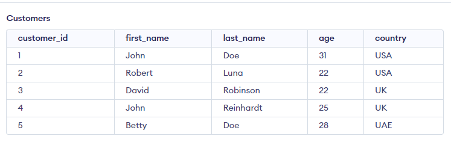
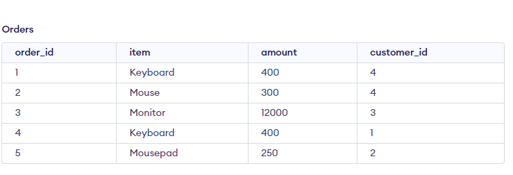
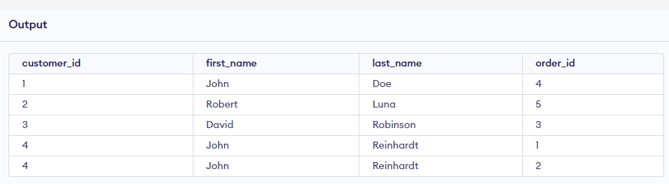

This Project assumes the following TABLES exists: 
1. Customers
   - customer_id, INT PRIMARY KEY,
   - first_name VARCHAR(100),
   - last_name VARCHAR(100),
   - age INT,
   - country VARCHAR(100),

2. Orders
   - order_id INTEGER PRIMARY KEY,
   - item VARCHAR(100),
   - amount INTEGER,
   -  customer_id INTEGER, 

The left_join.sql should output 
